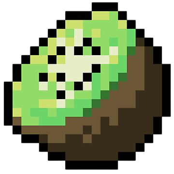

# KwCore | Kiwi Project 2025

<p align="center">
  
</p>

## Overview

KwCore is a high-performance CraftBukkit fork with modern optimizations and efficient chunk management. It leverages up-to-date libraries and APIs to enhance stability, performance, and security, laying a strong foundation for future improvements.

## Current Features, Optimizations and Fixes

- *Java 9+ Support:* Added support for Java 9 and above, allowing the use of modern Java features and optimizations.
- *Spigot patches:* The project includes Spigot patches for performance and stability improvements.
- *Modern API:* Partial UUID support and some backports from modern Bukkit API.
- *Modern libraries:* All libraries are up to date. Unused libraries have been removed.
- *Chunk Management:* The project uses a custom chunk management system that optimizes chunk loading and unloading, reducing disk IO, memory usage and improving performance.
- *Cuckoo Hashing for Chunks:* The project uses a custom `HashMap` (And also `HashSet`) implementation based on cuckoo hashing to store chunks. This optimization guarantees worst-case constant lookup time, minimizing the overhead of hash collisions and significantly improving the performance of chunk access, insertion, and deletion.
- *Book Metadata Sanitation:* This fix prevents players from sending arbitrary metadata into books as a means of cheating, effectively blocking any attempt to inject unauthorized data.
- *Memory Allocation:* Reduced memory allocations during tick processing. This patch affects block physics, world generation, and entity ticking.
- *Fire Ticking:* Fire spread is now more efficient.
- *Spigot AntiXray Fix:* Resolves issues with the built-in Spigot AntiXray. 

And many more...

## Future Features, Optimizations and Fixes

- Better documentation.
- Add modern Bukkit API support.
- Implement full UUID support.
- Remove data limit per chunk. Fixes chunk overload.
- Ghasts can crash the server when they are spawned at large coordinates. It should be fixed.
- Redstone can cause lags or even stack overflow errors (it uses recursion). It should be fixed too.
- Add threaded chunk generation. (Maybe)
- Add threaded pathfinding. (Maybe)
- Add threaded entity and world ticking. (Maybe)

## Build and Development

KwCore uses Gradle for building and dependency management. To build the project, you need to have Java 8 or higher installed.

### Using Gradle

```bash
./gradlew clean shadowJar
```

This will create a JAR file in the `build/libs` directory.

## Maintainers

- Rasphost
- Expandion